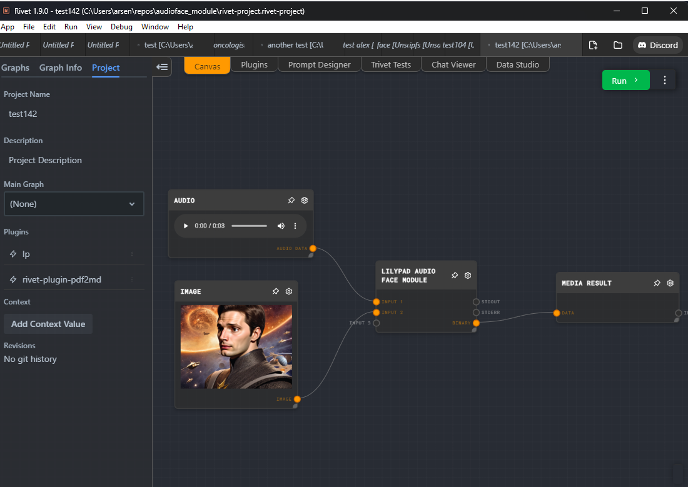
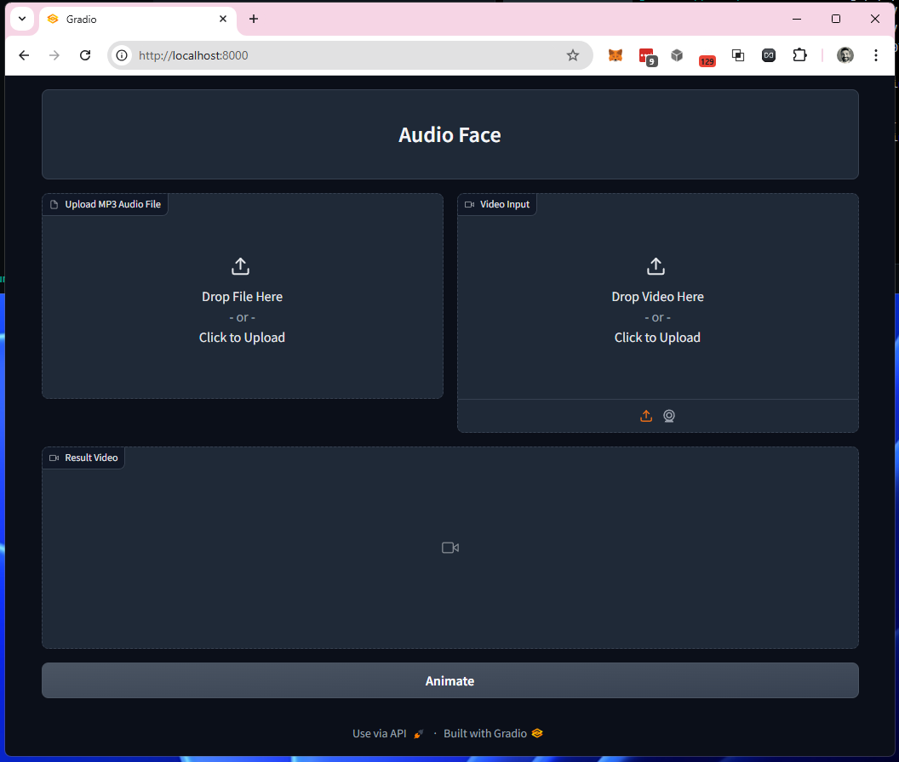

# Quickstart

### About
This repo was created as an example recepie to demonstrate how to build Lilypad Modules that can run at scale on a distributed GPU Network. You can run the module directly using the Rivet IDE by installing Lilypad Plugin or by building a production application that runs the module from a custom user interface, telegram bot, discord bot, etc...

The module takes in two inputs 
1. Audio File
2. Video File

The result is a video with lip animation imposed on to the original file video file with audio from the input.

#### Dev Prequisites
* git https://git-scm.com/downloads
* vscode https://code.visualstudio.com/download
* python environments  https://marketplace.visualstudio.com/items?itemName=ms-python.vscode-python-envs
* python --version Python 3.9.21 https://www.python.org/downloads/
* ipfs daemon (for client testing)(bundled in docker) or download https://docs.ipfs.tech/install/ipfs-desktop/
* rivet (for client testing) https://rivet.ironcladapp.com/

#### Setup (terminal commands)

*  `git clone https://github.com/arsen3d/audioface_module`
*  `cd audioface_module`

###### Windows 
*  `copy-checkpoints.bat`
*  `win-run.bat`
###### Mac
*  `copy-checkpoints.sh`
*  `mac-run.sh`

###### Docker
*  `docker-compose up`
*  open in browser `http://localhost:8001`

#### How it works
This project is comprised of several key components.
* Lilypad Module - For defining how this process would run on Lilypad Network
* Gradio - For testing via broswer.
* Rivet - For developing custom workflows via desktop app. Also see how a custom workflow can be wrapped in a custom app (https://github.com/Ironclad/rivet-example)
* API (Optional) Developers can host the API for submitting jobs on to Lilypad Network or use a public one.
* Developer Dashboard / Faucet(Optional) - used to get a secret key for api. 

#### Workflow
Best place to start is by installing the Rivet App with Rivet Lilypad Plugin. This provides an easy interface for experimenting with your own custom workflows. 

To be clear, Gradio and Rivet are intended as visual support and test tools to build the Lilypad Moduls.

#### GUI Tools
##### Rivet

##### Gradio
